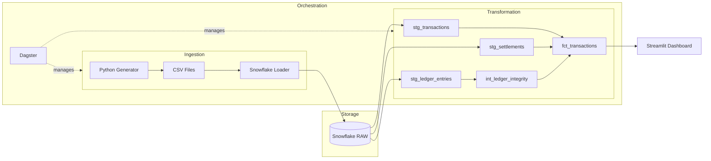

# OpenLedger: Financial Reconciliation Platform

  

OpenLedger is an automated financial reconciliation engine designed to replace manual Excel processes with a modern, scalable data pipeline. It ingests transactional data, enforces strict schemas to guarantee data integrity, and reconciles internal ledgers against external banking settlement files to detect financial discrepancies (fraud, data loss, fee mismatches, etc.).

## Setup & Run Instructions

### Prerequisites
* Python 3.10+
* Snowflake account (trial is fine)

### Installation

```bash
# Clone the repository
git clone https://github.com/dassus98/open-ledger.git
cd open-ledger

# Create and activate a virtual environment (Recommended)
python -m venv venv
source venv/bin/activate  # On Windows: venv\Scripts\activate

# Install dependencies
pip install -r requirements.txt
```

## Architecture
**ELT Pipeline:** Python (Ingestion) → Snowflake (Storage) → dbt (Transformation) → Dagster (Orchestration)



* Python was used to generate realistic fintech transactions. Incorrect data was artificially incorporated to ensure that the pipeline is resilient and capable of handling errors.
* Snowflake was chosen for its separation of storage and compute, which allows us to scale the system to larger quantities of data while efficiently keeping data ingestion and transformation apart.
* dbt was chosen to enable modularity, documentation and version control for SQL. Jinja was used to enable dynamic SQL code.
* Dagster was chosen over Airflow for its asset-based advantages (i.e. easier to connect a data pipeline), native integration with dbt, and faster debugging. Python scripts and dbt models were treated as Software-Defined Assets in this project.
* Automated circuit breakers were incorporated to stop the pipeline if data quality tests fail (e.g. `not_null`, `unique`). For purposes of demonstration, the severity of the circuit breakers were kept as 'warn' rather than 'error'.

## Core Features
* Decoupled ingestion and transformation layers managed by a single DAG. This allows for fault isolation (makes debugging easier), makes changing the business logic easier, and creates an identifiable audit trail.
* Used staging layers to clean up raw data (type casting, null handling) before it hits production tables.
* Integrated dbt tests enforce data contracts which prevent low-quality data from entering the fact tables (severity set to 'warn' for demonstration purposes).

## Tech Stack
* Python
* Snowflake
* dbt Core
* SQL, Jinja
* Dagster
* Streamlit

## Business Value
In a real-world scenario, this system:
1.  Automates T+1 reconciliation which reduces close-time and eliminates month-end crunch.
2.  Prevents revenue leakage by instantly flagging transactions where money was received but not recorded.
3.  Provides full data lineage from ingestion source to the final report, ensuring audit compliance.